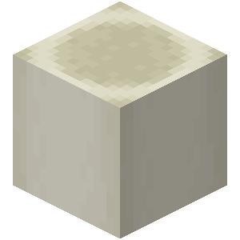
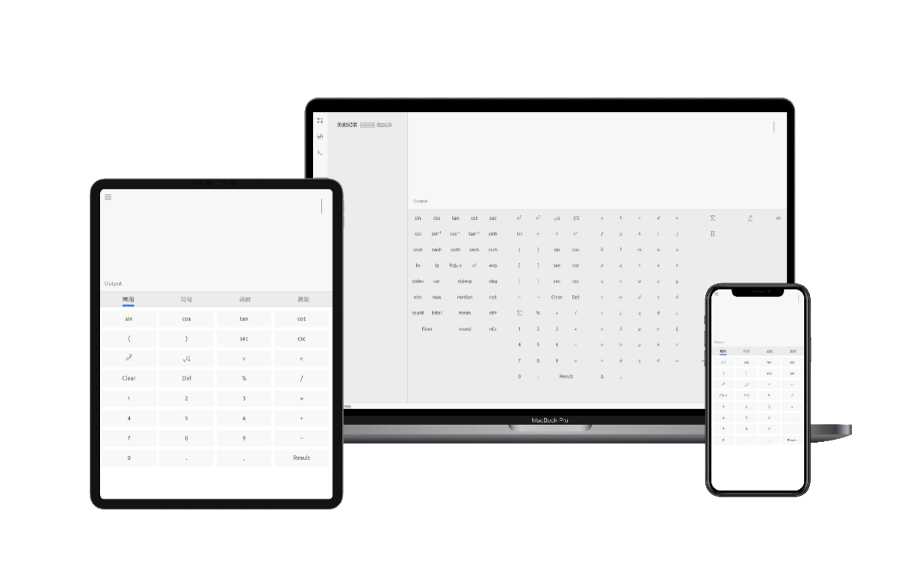

<div align="center">



# Calcium Calculator

[](https://github.com/NriotHrreion)
[](./LICENSE)
[](https://github.com/nocpiun/calcium/stargazers)
[](https://github.com/nocpiun/calcium/actions/workflows/test.yml)
[](https://app.netlify.com/sites/courageous-bublanina-6857c1/deploys)

> A web-based calculator app

</div>



## Description

Calcium is a web-based calculator written in React + Typescript.

If you encounter any problems or have any ideas, feel free to open an issue to let me know.

_[Here is the Wiki](https://github.com/nocpiun/calcium/wiki)_

_[Here is the Manual](https://github.com/nocpiun/calcium/wiki/Manual)_

#### Why is its name Calcium?

```
Calculator -> calc -> Ca (Chemical Element) -> Calcium
```

#### What features does it include?

- Basic calculating
- Sigma & Integral & Product calculating
- Variable creating and storing
- Function Images Graphing
- Base conversion
- Unit conversion
- Relationship calculating (Thanks to [relationship.js](https://github.com/mumuy/relationship))
- Currency exchanging
- History recording

## Deploy & Use

**It is recommended to access Calcium via [calcium.js.org](https://calcium.js.org). However, if you prefer to deploy it locally, please proceed to read the following instructions.**

#### Docker

First, you need to make sure you have had [Docker](https://docker.com) installed on your server (or computer).

1. Pull docker repository

```bash
docker pull noahhrreion/calcium:main
```

2. Create container

```bash
docker run -p 3000:3000 noahhrreion/calcium:main
```

3. Enter `http://localhost:3000`, and you can start using Calcium.

#### Launch directly

First, you need to make sure you have had [Git](https://git-scm.com/downloads) & [Node.js](https://nodejs.org/en/download) installed on your server (or computer).

1. Clone Git repo

```bash
git clone https://github.com/nocpiun/calcium.git
```

2. Install dependencies

```bash
npm i
```

If it throws error at this step, try:

```bash
npm i --force
```

3. Launch Calcium

```bash
npm run start
```

4. Enter `http://localhost:3000`, and you can start using Calcium.

5. If you want to make contribution to this repo, just simply begin by modifying the code and starting debugging!

## Contributing

Contributions to Calcium are welcomed. You can fork this project and start your contributing. If you don't know how to do, please follow the instruction [Creating a Pull Request from a Fork](https://help.github.com/en/github/collaborating-with-issues-and-pull-requests/creating-a-pull-request-from-a-fork). And I'll review the Pull Requests in my spare time.

Also, you're supposed to run tests before submitting a commit to your PR.

```bash
npm run test
```

## Scripts

An explanation of the `package.json` scripts.

- **`start`** Launch the app
- **`build`** Create a production build
- **`test`** Run tests

## LICENSE

[MIT](./LICENSE)
